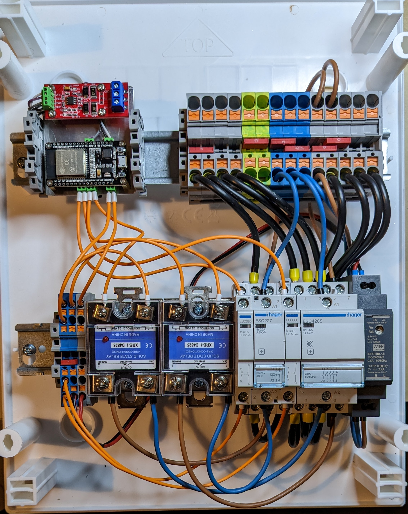

# Phasenumschaltung für Heidelberg Energy Control

## Warum?

Die Wallbox unterstützt von Hause aus keine automatische Umschaltung zwischen 1 und 3-Phasen Betrieb. Dabei kann die Wallbox sowohl 1 als auch 3-phasig angeschlossen werden. Um den Ertrag bei PV Überschussladen zu steigern, kann es insbesondere im Winter oder der Übergansgzeit hilfreich sein die Anzahl der Phasen je nach verfügbarer Leistung umzuschalten.

Viele behelfen sich mit einem Lasttrennschalter und schalten manuell um, aber da [evcc](https://evcc.io/) die automatische Umschaltung unterstützt wollte ich das auch für meine Wallbox nachrüsten.

## Wie?

Zwischen die Sicherung und die Wallbox kommt ein Kasten mit 2 Schützen, und eine Platine mit einem ESP32, RS485-TTL Adapter und zwei Relais. EVCC spricht mit dem Mikrocontroller ModbusTCP und erreicht darüber auch die Wallbox. Über ein zusätzliches Register [könnte EVCC die Anzahl der genutzten Phasen auslesen und setzen](https://github.com/evcc-io/evcc/discussions/6168#discussioncomment-4925261).

Beim Umschalten wird durch den ESP zuerst die Ladeleistung auf 0 reduziert und darauf gewartet, dass das Fahrzeug nicht mehr lädt. Anschließend wird die Wallbox komplett vom Strom getrennt und nach einer Pause von 2 Sekunden mit der gewünschten Phasenkonfiguration neu gestartet. Aus Sicht des Fahrzeugs gab es einen kurzen Stromausfall. Dadurch, dass die Ladeleistung vorher auf 0 reduziert wurde, wird nicht unter Last geschaltet.

## Funktioniert das wirklich?

Ich habe meinen Prototyp gebaut und mit meiner Wallbox getestet - das sieht sehr gut aus. Die Kommunikation zwischen EVCC und der Wallbox über den ESP funktioniert einwandfrei. Die manuelle Umschaltung über das Webinterface des ESP und über ein Modbus Register funktioniert mit und ohne Auto. Auch die Umschaltung über das evcc Webinterface und die automatische Umschaltung abhängig vom Überschuss funktioniert ([mit der modifizierten evcc Version](https://github.com/zivillian/evcc)) problemlos.

 Die nächsten Schritte sind:

1. evcc Patch upstreamen
1. *Party*

## Darf ich das?

**Nope!**

Nach [§13 Abs. 2 Satz 4 NAV](https://www.gesetze-im-internet.de/nav/__13.html "Niederspannungsanschlussverordnung ") darf das ...
> [...] nur durch ein in ein Installateurverzeichnis eines Netzbetreibers eingetragenes Installationsunternehmen durchgeführt werden [...].

## Ist das sicher?

Da jegliche Kommunikation mit der Wallbox über den ESP läuft ist sichergestellt, dass während des Umschaltvorgangs keine anderen Befehle an die Wallbox gesendet werden.

In der Steuerung sind der Leistungsteil und die Logik strikt getrennt - der Mikrocontroller steuert über seine GPIOs nur die Relais, die wiederrum die Schütze ansteuern. Über Hilfsschalter an den Schützen kann der Mikrocontroller den aktuellen Zustand auslesen - durch die Hilfsschalter sind auch die Strompfade zwischen AC und DC physisch getrennt. Die beiden Schütze sind elektrisch gegeneinander verriegelt - es kann also immer nur ein Schütz angezogen sein. Eine versehentliche Umschaltung während eines Ladevorgangs ist also ausgeschlossen. Selbst im Worst-Case wird die Wallbox durch den Aufbau in jedem Fall (wenn auch nur sehr kurz) vom Strom getrennt bevor sich die Phasenkonfiguration ändert - damit muss jedes Fahrzeug umgehen können.

## Kann ich mal sehen?

Klar!

## Aber, warum ...?

### ... Hilfsschalter an den Schützen?

Ja, der ESP weiß was er auf den GPIOs ausgegeben hat und könnte einfach dran glauben, dass der Rest sich wie geplant verhält. Bei den ersten Tests mit Solid State Relais hat sich aber gezeigt, dass die Schütze noch einige Sekunden angezogen bleiben, nachdem der GPIO auf `LOW` gesetzt wurde. Darüber hinaus lässt sich ein klebendes Schütz eindeutig erkennen - das ist mir mit meinem 1P Schütz nach wenigen Tagen passiert.

### ... nicht einfach NodeRED und ein Shelly

Die Gesamtleistung der meisten Shelly liegt unter den benötigen 16A bzw. 48A (3 * 16A) bei 230V. Das Hauptproblem ist aber, dass die Kommunikation mit der Wallbox am Shelly vorbei läuft - dadurch ist es möglich, dass kurz vor dem Umschalten der Ladevorgang wieder gestartet wird und das Fahrzeug es nicht verträgt, dass während eines laufenden Ladevorgangs Phasen verschwinden oder zugeschaltet werden. Im schlimmsten Fall fängt es an zu brennen.

### ... ist dann mein Auto abgefackelt?

Das kann dir [dein Elektriker](#darf-ich-das) sicher beantworten.

### ... Schütze von 2 verschiedenen Herstellern?

Der Hersteller ist egal, die Leistung ist wichtig und brummfrei kann bei EMV helfen. Ursprünglich hatte ich beide Schütze von Hager, aber der 1P Schütz war nicht brummfrei und hat Störungen verursacht die manchmal zum Reboot des ESP führten. Da es keinen passenden Schütz von Hager gab, hab ich einen von ABB verbaut.

### ... hast du nicht *XYZ*, dass wär doch viel einfacher / besser / schöner?

Wenn du Ideen hast, [immer her damit](https://github.com/zivillian/heidelberg-1p3p/issues/new).

## Einkaufszettel

Folgende Artikel hab ich verbaut (**keine** Affiliate Links):
| Beschreibung                      | Artikel
| --------------------------------- | -------
| Schütz 1S/1Ö 20A                  | [ABB ESB20-11N-06](https://new.abb.com/products/de/1SBE121111R0611/esb20-11n-06)
| Hilfsschalter                     | [ABB EH04-11N](https://new.abb.com/products/de/1SAE901901M1011/eh04-11n)
| Schütz 3S/1Ö 25A                  | [Hager ESC428S](https://hager.com/de/katalog/produkt/esc428s-installationsschuetz-brumm-25a-3s1oe-230v)
| Hilfsschalter                     | [Hager ESC080](https://hager.com/de/katalog/produkt/esc080-hilfsschalter-6a-1s1oe)
| Netzteil                          | Ich habe ein [MeanWell HDR-15-5](https://www.amazon.de/dp/B06XWQSJGW) im Einsatz, da ich zuerst eine andere Platine genutzt habe. Für das Dingtian Board besser die [12V Variante](https://www.amazon.de/dp/B06XWSYRCF) nehmen.
| ESP / Modbus / Relais Platine     | [Dingtian DT-R002 mit RS485](https://www.dingtian-tech.com/en_us/relay2.html)  Bei der Bestellung unbedingt angeben, dass du ein DEV Board haben möchtest - [ansonsten kann da keine eigene Firmware aufgespielt werden](https://templates.blakadder.com/dingtian_DT-R008.html#warning).
| Befestigung Platine               | Ich habe mir einen Hutschienenadapter drucken lassen, aber es gibt auch [passende Gehäuse](https://www.dingtian-tech.com/img/2channel/DIN35.jpg).
| AC Verteilung / Klemmen           | [Phoenix PT-6](https://www.phoenixcontact.com/de-de/produkte/durchgangsklemme-pt-6-3211813) ([Deckel](https://www.phoenixcontact.com/de-de/produkte/abschlussdeckel-d-pt-6-3212044), [Brücken](https://www.phoenixcontact.com/de-de/produkte/steckbruecke-fbs-2-8-3030284) und [Endhalter](https://www.phoenixcontact.com/de-de/produkte/endhalter-clipfix-35-5-3022276) nicht vergessen) Es geht auch PT-4, aber du willst die Wallbox in jedem Fall mit ausreichendem Querschnitt anschließen und kein 6mm² in die PT-4 fummeln.
| DC Verteilung / Klemmen           | [Phoenix PT 2,5](https://www.phoenixcontact.com/de-de/produkte/mehrleiterklemme-pt-25-quattro-3209578) ([Deckel](https://www.phoenixcontact.com/de-de/produkte/abschlussdeckel-d-st-25-quattro-3030514) und [Brücke](https://www.phoenixcontact.com/de-de/produkte/steckbruecke-fbs-2-5-3030161) nicht vergessen)
| Kabel                             | [H07 V-K 6mm²](https://www.hornbach.de/shop/Aderleitung-H07-V-K-1x6-mm-schwarz-Meterware/5188575/artikel.html) (schwarz) für den Leistungsteil
| Kabel                             | H07 V-K 1,5mm² [blau](https://www.stex24.de/124831-h07v-k-einzelader-pvc-dunkelblau-4520141) und [braun](https://www.stex24.de/124829-nyy-o-einzelader-pvc-braun-4520031) für die Ansteuerung der Schütze
| Kabel                             | [H05 V-K 0,5mm²](https://www.stex24.de/124802-h05v-einzelader-pvc-orange-4510091) für den DC Teil
